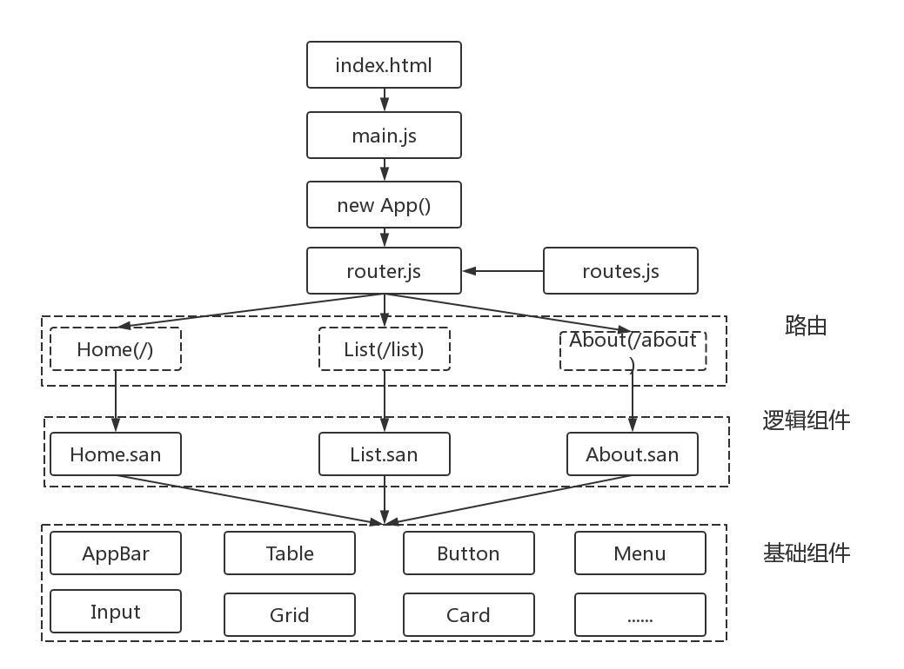

#### 引言

众所周知，Web 系统的早期路由是由后端来实现的，服务器根据 URL 来重新加载整个页面。这种做法用户体验不但不好，而且页面若是变得复杂，服务器端的压力也会随之变大。随着 Ajax 的广泛应用，页面能够做到无需刷新浏览器也可更新数据，这也给单页应用和前端路由的出现奠定了基础。因此，在单页应用系统中使用前端路由也十分常见，很多前端框架也提供或者推荐配套使用的路由系统。san-router 是 San 框架的官方 router ，以方便用户基于 san 构建单页或同构应用为目标。本文也主要来说明实践过程中如何使用 san-router 来构建一个单页面后台管理系统。

#### 示例

<p data-height="265" data-theme-id="0" data-slug-hash="VzQeZm" data-default-tab="js,result" data-user="sqliang" data-embed-version="2" data-pen-title="san-router-spa" class="codepen">See the Pen <a href="https://codepen.io/sqliang/pen/VzQeZm/">san-router-spa</a> by sqliang (<a href="https://codepen.io/sqliang">@sqliang</a>) on <a href="https://codepen.io">CodePen</a>.</p>
<script async src="https://production-assets.codepen.io/assets/embed/ei.js"></script>


#### 单页应用系统整体结构

使用 san-router 和 San 构建单页应用的系统主要基于路由和组件。路由处理放在浏览器端来直接响应浏览器地址的变换，分发到对应的路由。在路由发生变化时，不再刷新整个页面，而是通过加载、组合相应的组件，替换需要改变的部分，来向用户呈现对应的界面。整体结构如下图所示：



从结构图中可知，整个单页应用后台系统有如下几个特点：
1. 整个项目只有一个html文件。在用户访问系统浏览器起初只加载html文件，html文件通过引入san和san-router来实现根据路由加载、渲染组件的目的。
2. san-router通过暴露router对象来添加路由规则和组件对应关系,启动路由,监听路由。
3. 在创建App组件实例时传入router.js相关路由配置，来达到根据路由加载逻辑组件的目的。
4. 逻辑组件由多个基础组件组装而成,在路由发生变化时，加载不同的逻辑组件，从而达到向用户呈现对应界面的效果。


#### 路由配置

san-router 的 router 对象用于将特定的URL对应到相应组件类上,在 URL 变化并匹配路由规则时,将对应组件初始化并渲染到页面中。
因此,我们可以通过调用router.add({Object}options)来添加路由规则。在options对象中指定Component和target参数,当规则匹配时将对应Component渲染到target上。

> san-router有两种路由规则配置:
> rule为string时,URL的path部分与字符串完全匹配才可;
> rule为RegExp(正则)时,URL的path部分与该正则部分匹配即可。

```javascript
// 路由对象router
let router = sanRouter.router;
// 路由配置
const routes = [
  {
    rule: '/',
    Component: Home
  },
  {
    rule: '/list',
    Component: List
  },
  {
    rule: '/about',
    Component: About
  }
];
routes.forEach(item => {
  router.add({
    ...item,
    target: '#main'
  });
});
```
#### 模板组件创建

App作为系统的模板组件,在创建实例后被附加到id为app的div上。另外,在实例创建过程中,通过传入配置好的路由对象,来加载不同的逻辑组件:

```
// 创建App实例,附加到id为app的div上
new App({
  data: {
    router
  }
}).attach(document.getElementById('app'));

```

App作为基本模板组件,布局了整个系统界面不需要更新的部分,搭建出了系统界面基本的骨架。那些需要更新的部分则是在App组件被附加到页面后,通过调用startRoute()函数启动路由,来加载不同的逻辑组件。

startRoute函数中可以根据传入的router对象来匹配路由规则,然后启动并监听路由。由此也就可以根据路由的配置,在路由发生变化时,加载不同的逻辑组件,更新数据,呈现给用户不同的内容。

```
// App Component
class App extends san.Component {
  static components = {
    'router-link': Link
  };
  static template = `
        <div class="app-container">
          <div class="app-drawer">
              <div class="drawer-title">
                <h3>XXX管理系统</h3>
              </div>
              <div class="menu">
                  <ul>
                      <li><router-link to="/">Home</router-link></li>
                      <li><router-link to="/list">List</router-link></li>
                      <li><router-link to="/about">about</router-link></li>
                  </ul>
              </div>
          </div>
          <div class="app-bar">
              <div class="user-info">
                  <span>userName</span>
              </div>
          </div>
          <div class="app-content">
            <div id="main"></div>
          </div>
         </div>
      `;
      attached() {
        //启动路由
        this.startRoute();
      }
      startRoute(){
        let router = this.data.get('router');
        router.setMode('html5');
        // 路由监听
        router.listen((e, config) => {//
          // 在路由发生变化时触发
        });
        //启动路由
        router.start();
      }
}
```


#### 逻辑组件说明

本文逻辑组件是指通过路由对象渲染到页面中的业务逻辑组件。这些组件(Home,List, About等)按照业务逻辑,由基础组件库中的组件组装而成,在匹配到对应路由时,进行初始化和渲染。

#### 总结

单页应用基于前端路由、组件化思想和前端数据流方案。因此,在构建一个单页应用系统时,需要重点关注路由,组件和数据流方案这三个环节。对于业务比较复杂多变的后台管理系统,复用组件、有效管理ajax请求和前端数据流有利于提高开发和运维效率。所以,在实践中单页应用也成为被广泛应用。但是,每种技术方案也有其局限性,单页应用要在一个页面上提供所有功能,首次需要加载大量资源,资源加载时间也相对较长。
