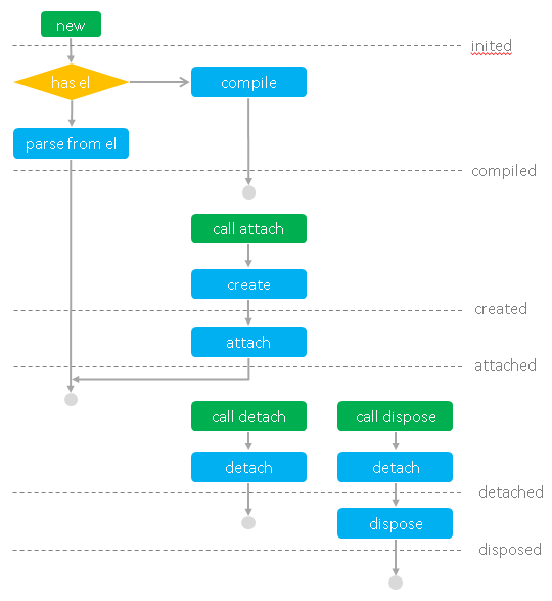

组件是 San 的基本单位，是独立的数据、逻辑、视图的封装单元。从页面的角度看，组件是 HTML 元素的扩展。从功能模式的角度看，组件是一个 ViewModel。


组件定义
------

定义组件最基本的方法是，从 **san.Component** 继承。San 提供了 **san.inherits** 方法，用于继承。

```javascript
function MyApp(options) {
    san.Component.call(this, options);
}
san.inherits(MyApp, san.Component);

MyApp.prototype.template = '<ul><li s-for="item in list">{{item}}</li></ul>';

MyApp.prototype.attached = function () {
    this.data.set('list', ['san', 'er', 'esui', 'etpl', 'esl']);
};
```

然后，通过 new 的方式就可以使用这个组件了。当然，通常你可能希望让组件出现在页面上，所以需要调用 attach 方法，将组件添加到页面的相应位置。


```javascript
var myApp = new MyApp();
myApp.attach(document.body);
```

通过继承的方式定义组件的好处是，当你使用 ESNext 时，你可以很自然的 extends。

`注意`：由于 ESNext 没有能够编写 prototype 属性的语法，所以 San 对组件定义时的属性支持 static property。通过 ESNext 的 extends 继承时，template / filters / components 属性请使用 static property 的方式定义。

```javascript
import {Component} from 'san';

class HelloComponent extends Component {

    constructor(options) {
        super(options);
        // .....
    }

    static template = '<p>Hello {{name}}!</p>';

    initData() {
        return {name: 'San'}
    }
}

new HelloComponent().attach(document.body);
```

对于不使用 ESNext 时，写一个 function 然后调用 **san.inherits** 再写各种 prototype 实在是有点麻烦，San 提供了快捷方法 **san.defineComponent** 用于方便地定义组件。

```javascript
var MyApp = san.defineComponent({
    template: '<ul><li s-for="item in list">{{item}}</li></ul>',

    attached: function () {
        this.data.set('list', ['san', 'er', 'esui', 'etpl', 'esl']);
    }
});
```


生命周期
------

San 的组件是 HTML 元素扩展的风格，所以其生命周期与 WebComponents 相符合。

- `compiled` - 组件视图模板编译完成
- `inited` - 组件实例初始化完成
- `created` - 组件元素创建完成
- `attached` - 组件已被附加到页面中
- `detached` - 组件从页面中移除
- `disposed` - 组件卸载完成

组件的生命周期有这样的一些特点：

- 生命周期代表组件的状态，生命周期本质就是状态管理。
- 在生命周期的不同阶段，组件对应的钩子函数会被触发运行。
- 并存。比如 attached 和 created 等状态是同时并存的。
- 互斥。attached 和 detached 是互斥的，disposed 会互斥掉其它所有的状态。
- 有的时间点并不代表组件状态，只代表某个行为。当行为完成时，钩子函数也会触发。如 **updated** 代表每次数据变化导致的视图变更完成。


通过生命周期的钩子函数，我们可以在生命周期到达时做一些事情。比如在生命周期 **attached** 中发起获取数据的请求，在请求返回后更新数据，使视图刷新。

```javascript
var ListComponent = san.defineComponent({
    template: '<ul><li s-for="item in list">{{item}}</li></ul>',

    initData: function () {
        return {
            list: []
        };
    },

    attached: function () {
        requestList().then(this.updateList.bind(this));
    },

    updateList: function (list) {
        this.data.set('list', list);
    }
});
```


下图详细描述了组件的生存过程：




视图
------

### 视图模板

定义组件时，通过 template 可以定义组件的视图模板。


```javascsript
san.defineComponent({
    template: '<div>'
        + '<label><input type="checkbox" value="errorrik" checked="{= online =}">errorrik</label>'
        + '<label><input type="checkbox" value="otakustay" checked="{= online =}">otakustay</label>'
        + '<label><input type="checkbox" value="firede" checked="{= online =}">firede</label>'
        + '</div>',

    initData: function () {
        return {
            online: ['errorrik', 'otakustay']
        };
    }
});
```

通常，将 HTML 片段写在 JavaScript 中是不友好的，我们可以把模板写在单独的文件里，通过工具或装载器去管理。

在 webpack + ESNext 环境下引用模板：

```
待补充
```

在 AMD 环境下通过 text plugin 引用模板：

```javascript
san.defineComponent({
    template: require('text!./template.html'),

    initData: function () {
        return {
            online: ['errorrik', 'otakustay']
        };
    }
});
```

`强调`：San 要求组件对应 **一个** HTML 元素，所以视图模板定义时，只能包含一个 HTML 元素，其它所有内容需要放在这个元素下。

```html
<!-- 正确 -->
<dl>
    <dt>name - email</dt>
    <dd s-for="p in persons" title="{{p.name}}">{{p.name}}({{dept}}) - {{p.email}}</dd>
</dl>

<!-- 错误 -->
<p>name</p>
<p>email</p>
```

组件对应的 HTML 元素可能是由其 **owner** 组件通过视图模板指定的，视图模板不好直接定死对应 HTML 元素的标签。此时可以将视图模板对应的 HTML 元素指定为 **template**。

```html
<template class="ui-timepicker">{{ value | valueText }}</template>
```


### 插槽

在视图模板中可以通过 slot 声明一个插槽的位置，其位置的内容可以由外层组件定义。具体请参考[插槽](../slot/)文档。

```javascript
var Panel = san.defineComponent({
    template: '<div>'
        + '  <div class="head" on-click="toggle">title</div>'
        + '  <p style="{{fold | yesToBe(\'display:none\')}}"><slot></slot></p>'
        + '</div>',

    toggle: function () {
        this.data.set('fold', !this.data.get('fold'));
    }
});

var MyComponent = san.defineComponent({
    components: {
        'ui-panel': Panel
    },

    template: '<div><ui-panel>Hello San</ui-panel></div>'
});

/* MyComponent渲染结果
<div>
  <div class="head">title</div>
  <p style="display:none">Hello San</p>
</div>
*/
```


### el


组件实例的属性 **el** 表示组件对应的 HTML 元素，组件初始化时可以通过 option 传入。

基本上在编写组件时不需要关心它，但是在初始化组件时如果传入 **el**，意味着让组件以此元素作为组件根元素。元素将：

- 不会使用预设的 template 渲染视图
- 不会创建根元素
- 直接到达 compiled、created、attached 生命周期

有时我们为了首屏时间，期望初始的视图是直接的 HTML，不希望初始视图是由组件渲染的。但是我们希望组件为我们管理数据、逻辑与视图，后续的用户交互行为与视图变换通过组件管理，此时就可以通过 **el** 传入一个现有元素。

组件将以 **el** 传入的元素作为组件根元素并反解析出视图结构。这个过程我们称作 **组件反解**。详细请参考[组件反解](../reverse/)文档。


数据
----

所有组件数据相关的操作，都由组件实例的 **data** 成员提供。

### 获取数据

通过 **data.get** 方法可以获取数据。

```javascript
san.defineComponent({
    attached: function () {
        var params = this.data.get('params');
        this.data.set('list', getList(params[1]));
    }
});
```

**data.get** 方法接受一个表示 property accessor 的字符串，所以上面的例子也可以写成这样：

```javascript
san.defineComponent({
    attached: function () {
        var param = this.data.get('params[1]');
        this.data.set('list', getList(param));
    }
});
```

### 操作数据

**data** 上提供了一些数据操作的方法，具体请参考[数据操作](../data-method/)文档。


### 初始数据

组件在实例化时可以通过 option 传入 **data**，指定组件初始化时的数据。

```javascript
var MyApp = san.defineComponent({
    template: '<ul><li s-for="item in list">{{item}}</li></ul>'
});

var myApp = new MyApp({
    data: {
        list: ['san', 'er', 'esui', 'etpl', 'esl']
    }
});
myApp.attach(document.body);
```

new 时传入初始数据是针对实例的特例需求。当我们希望在定义组件时，就设置每个实例的初始数据，可以通过 **initData** 方法指定组件初始化时的数据。**initData** 方法返回组件实例的初始化数据。

```javascript
var MyApp = san.defineComponent({
    template: '<ul><li s-for="item in list">{{item}}</li></ul>',

    initData: function () {
        return {
            list: ['san', 'er', 'esui', 'etpl', 'esl']
        };
    }
});

var myApp = new MyApp();
myApp.attach(document.body);
```

### 计算数据

有时候，一个数据项的值可能由其他数据项计算得来，这时我们可以通过 **computed** 定义计算数据。 **computed** 是一个对象，key 为计算数据项的名称，value 是返回数据项值的函数。

```javascript
san.defineComponent({
    template: '<a>{{name}}</a>',

    // name 数据项由 firstName 和 lastName 计算得来
    computed: {
        name: function () {
            return this.data.get('firstName') + ' ' + this.data.get('lastName');
        }
    }
});
```

上面的例子中，name 数据项是计算数据，依赖 firstName 和 lastName 数据项，其值由 firstName 和 lastName 计算得来。

`注意`：计算数据的函数中只能使用 *this.data.get* 方法获取数据项的值，不能通过 this.method 调用组件方法，也不能通过 this.data.set 设置组件数据。

```javascript
san.defineComponent({
    template: '<a>{{info}}</a>',

    // name 数据项由 firstName 和 lastName 计算得来
    computed: {
        name: function () {
            return this.data.get('firstName') + ' ' + this.data.get('lastName');
        },

        info: function () {
            return this.data.get('name') + ' - ' + this.data.get('email');
        }
    }
});
```

计算数据项可以依赖另外一个计算数据项，上面的例子中，info 项依赖的 name 项就是一个计算数据项。但是使用时一定要注意，不要形成计算数据项之间的循环依赖。


过滤器
------

在定义视图模板时，插值是常用的展现数据的方式。在编写插值时，我们常使用 **过滤器** 将数据转换成适合视图展现的形式。

```
{{createTime | dateFormat('yyyy-MM-dd')}}
```

### 内置过滤器


San 针对常用场景，内置了几个过滤器：

- `html` - HTML 转义。当不指定过滤器时，默认使用此过滤器
- `url` - URL 转义
- `raw` - 不进行转义。当不想使用 HTML 转义时，使用此过滤器


### 定制过滤器

通过定义组件的 **filters** 成员，可以指定组件的视图模板可以使用哪些过滤器。

```javascript
san.defineComponent({
    template: '<a>{{createTime | dateFormat("yyyy-MM-dd")}}</a>',

    filters: {
        dateFormat: function (value, format) {
            return moment(value).format(format);
        }
    }
});
```

过滤器函数的第一个参数是表达式对应的数据值，过滤器调用时传入的参数从第二个参数开始接在后面。

`注意`：考虑到组件的独立性，San 没有提供全局过滤器注册的方法，组件要使用的过滤器必须在自身的 **filters** 中定义。


组件层级
-----

我们知道组件体系下，组件必须是可嵌套的树形关系。下面从一段代码，做一些说明。在下面的代码中，AddForm 内部使用了两个自定义组件：ui-calendar 和 ui-timepicker。

```html
<!-- Template -->
<div class="form">
    <input type="text" class="form-title" placeholder="标题" value="{= title =}">
    <textarea class="form-desc" placeholder="备注" value="{= desc =}"></textarea>

    <div>预期完成时间：
        <ui-calendar value="{= endTimeDate =}" s-ref="endDate"></ui-calendar>
        <ui-timepicker value="{= endTimeHour =}" s-ref="endHour"></ui-timepicker>
    </div>

    <div class="form-op">
        <button type="button" on-click="submit">ok</button>
    </div>
</div>
```

```javascript
var AddForm = san.defineComponent({
    // template

    components: {
        'ui-timepicker': require('../ui/TimePicker'),
        'ui-calendar': require('../ui/Calendar')
    },

    submit: function () {
        this.ref('endDate')
        this.ref('endHour')
    }
});
```


### components

组件中通常通过声明自定义元素，使用其它组件。

组件视图可以使用哪些子组件类型，必须通过定义组件的 **components** 成员指定。key 是自定义元素的标签名，value 是组件的类。

`注意`：考虑到组件的独立性，San 没有提供全局组件注册的方法，组件必须在自身的 **components** 中声明自己内部会用到哪些组件。

有些组件可能在内容中会使用自己，比如树的节点。我们可以将 **components** 中这一项的值设置为字符串 **self**。

```javascript
var Node = san.defineComponent({
    // template

    components: {
        'ui-node': 'self'
    }
});
```

### owner 与 parent

**owner** 与 **parent** 的概念已经被 react 明确过了，但这里还是要专门明确下。

**owner** 指的是目标在声明时位于哪个组件的组件视图中，其生存时间、交互的通信等行为都由 **owner** 管理。**owner** 必须是一个组件。ui-calendar 的 **owner** 是 AddForm 组件。

**parent** 指的是目标在视图中对应的直接父级元素。ui-calendar 的 **parent** 是其上层的 div。**parent** 对组件管理并没有直接的意义。


### ref

声明子组件时，如果通过 **s-ref** 指定了名称，则可以在owner组件实例的 **ref** 方法调用到。

`提示`：有了声明式的初始化、数据绑定与事件绑定，我们很少需要在 owner 中拿到子组件的实例。虽然 San 提供了这个途径，但当你用到它的时候，请先思考是不是非要这么干。


### 消息

通过 **dispatch** 方法，组件可以向组件树的上层派发消息。

```javascript
var SelectItem = san.defineComponent({
    template: '<li on-click="select"><slot></slot></li>',

    select: function () {
        var value = this.data.get('value');

        // 向组件树的上层派发消息
        this.dispatch('UI:select-item-selected', value);
    }
});
```

消息将沿着组件树向上传递，直到遇到第一个处理该消息的组件，则停止。通过 **messages** 可以声明组件要处理的消息。**messages** 是一个对象，key 是消息名称，value 是消息处理的函数，接收一个包含 target(派发消息的组件) 和 value(消息的值) 的参数对象。

```javascript
var Select = san.defineComponent({
    template: '<ul><slot></slot></ul>',

    // 声明组件要处理的消息
    messages: {
        'UI:select-item-selected': function (arg) {
            var value = arg.value;
            this.data.set('value', value);

            // arg.target 可以拿到派发消息的组件
        }
    }
});
```

消息主要用于组件与非 **owner** 的上层组件进行通信。比如，slot 内组件 SelectItem 的 **owner** 是更上层的组件，但它需要和 Select 进行通信。

```javascript
san.defineComponent({
    components: {
        'ui-select': Select,
        'ui-selectitem': SelectItem
    },

    template: ''
        + '<div>'
        + '  <ui-select value="{=value=}">'
        + '    <ui-selectitem value="1">one</ui-selectitem>'
        + '    <ui-selectitem value="2">two</ui-selectitem>'
        + '    <ui-selectitem value="3">three</ui-selectitem>'
        + '  </ui-select>'
        + '</div>'
});
```


### 动态子组件

在一些场景下，我们希望组件不在自身视图渲染时创建子组件，而是通过 JavaScript 灵活控制在未来的某些时间点创建子组件。比如：

- 浮动层子组件的 **parent** 不在其根元素 **el** 内，声明式用着不方便
- 列表只有在用户点击时才需要创建并展示


动态子组件对开发者要求更高，我们在这里给出一些需要注意的地方，下面节选的代码也做了一些简单的说明：

- 动态创建的子组件无需在 **components** 中声明类型
- 保证动态子组件不要被重复创建。常见的做法是在实例的属性上持有对创建组件的引用，并以此作判断
- 保证动态子组件能够被销毁。你可以在创建时 push 到 **children** 中，或者在 **disposed** 中销毁它

```javascript
san.defineComponent({
    mainClick: function () {
        if (!this.layer) {
            this.layer = new Layer();
            this.layer.attach(document.body);

            // 如果有下面一句，则可以不用手动在 disposed 中释放
            // this.children.push(this.layer);
        }

        this.layer.show();
    },

    disposed: function () {
        if (this.layer) {
            this.layer.dispose();
        }

        this.layer = null;
    }
});
```
